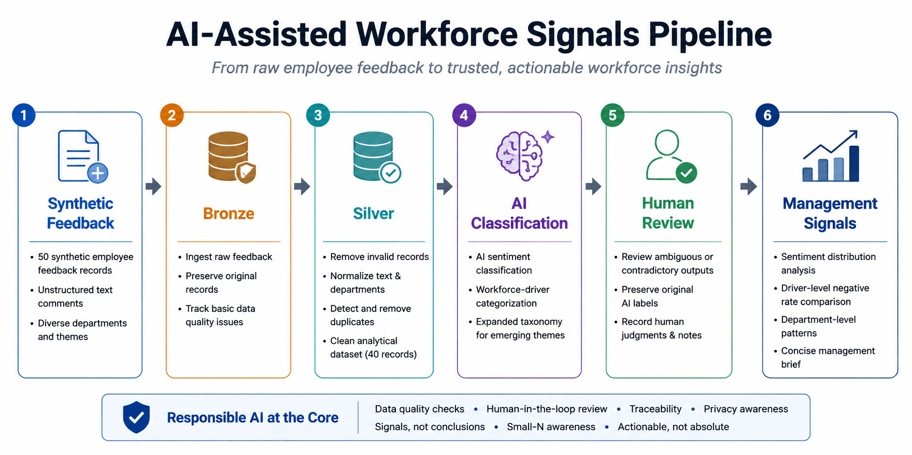

# AI-Assisted Workforce Signals Pipeline

An end-to-end workforce feedback analytics prototype built in Databricks, combining data quality controls, AI-assisted classification, human review, and management-level signal reporting.

> **Synthetic data only.** This project does not contain real company or employee data.

## Project Overview

Employee feedback is valuable but difficult to analyze at scale because it is unstructured, subjective, and often messy.

This project explores how Databricks and AI-assisted analytics can transform raw employee comments into structured workforce signals while keeping human judgment and traceability in the workflow.

The pipeline processes **50 synthetic employee feedback records**, cleans and validates the data, and produces a final analytical sample of **40 usable comments**.

## Workflow

**Synthetic Data → Bronze → Silver → AI Classification → Human Review → Management Signals**

### Bronze Layer
- Ingest raw employee feedback
- Preserve original records for traceability
- Identify basic data-quality issues

### Silver Layer
- Remove invalid records
- Normalize text and department values
- Detect and remove duplicates
- Produce a clean analytical dataset

### AI-Assisted Analysis
- Classify sentiment
- Assign workforce-driver categories
- Expand the taxonomy to capture emerging themes

### Human Review
- Flag ambiguous or contradictory AI outputs
- Preserve original AI labels
- Record reviewed judgments and override notes

### Management Reporting
- Analyze sentiment distribution
- Compare negative rates across workforce drivers
- Identify department-level patterns
- Generate a concise management brief

## Key Analytical Principle

A signal is not automatically a conclusion.

For example, all five comments categorized under **Workload** were negative. However, with such a small synthetic sample, this should be treated as an **emerging signal worth investigating**, not a validated organizational conclusion.

## Tools

- Databricks
- PySpark
- Spark SQL
- Databricks AI Functions
- Python
- Data Quality & QA
- AI-Assisted Analytics

## Responsible AI Considerations

A production version of this workflow would benefit from:

- Confidence scoring
- Systematic QA sampling
- Minimum group-size thresholds
- Privacy and access controls
- Continued human review of ambiguous outputs

## Visual Overview

## Notebook

See [`workforce_signals_pipeline.ipynb`](./workforce_signals_pipeline.ipynb) for the complete workflow and analysis.

## Disclaimer

This is an independent portfolio project created for learning and demonstration purposes. It is not affiliated with or commissioned by any employer or organization.
